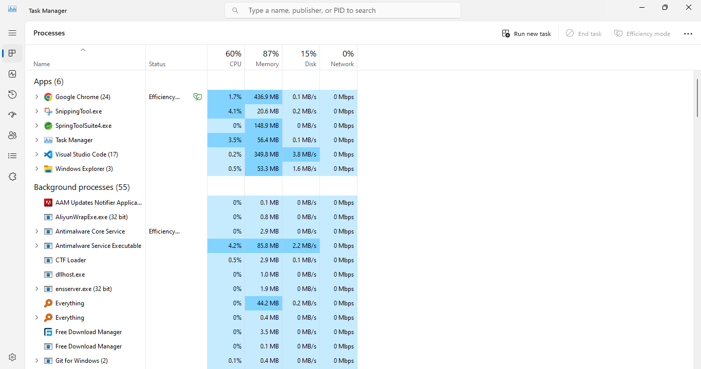
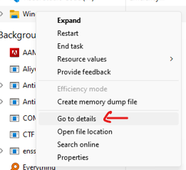
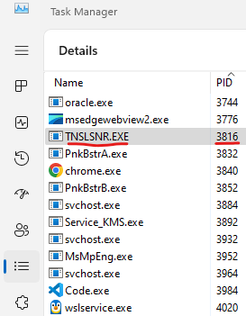

# With CLI  
```bash
netstat -ano | findstr :8080
```  
#### Output:  
```vbnet
TCP    0.0.0.0:8080           0.0.0.0:0              LISTENING       4060
```  
```bash
taskkill /PID 4060 /F   
# replace your own PID with 4060
```  

# With GUI  
kill the PID from task manager  
here at local machine the port is `8080` & the PID is `3816`  
1. Open task manager  
2. ### Preview:  
  
2. right click on any task & click on GO to properties  
### Preview:  
  
3. Mostly the app name of that port will be: `TNSLSNR.EXE`
### Preview:  
  
4. right click on it & end/kill the task  


Reasons why port is busy.  
1. you directly run same spring instance without shutting old instance, just shut the old instance by clicking on red square at the terminal panel of spring console & run again or just restart the application by restart button.  
2. another application using same port.  